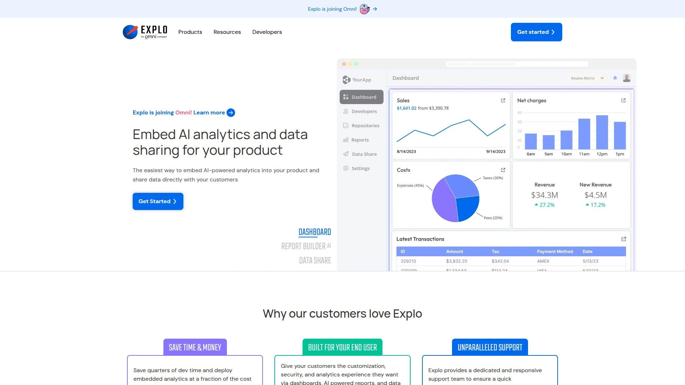
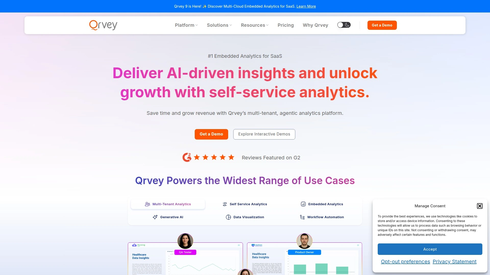
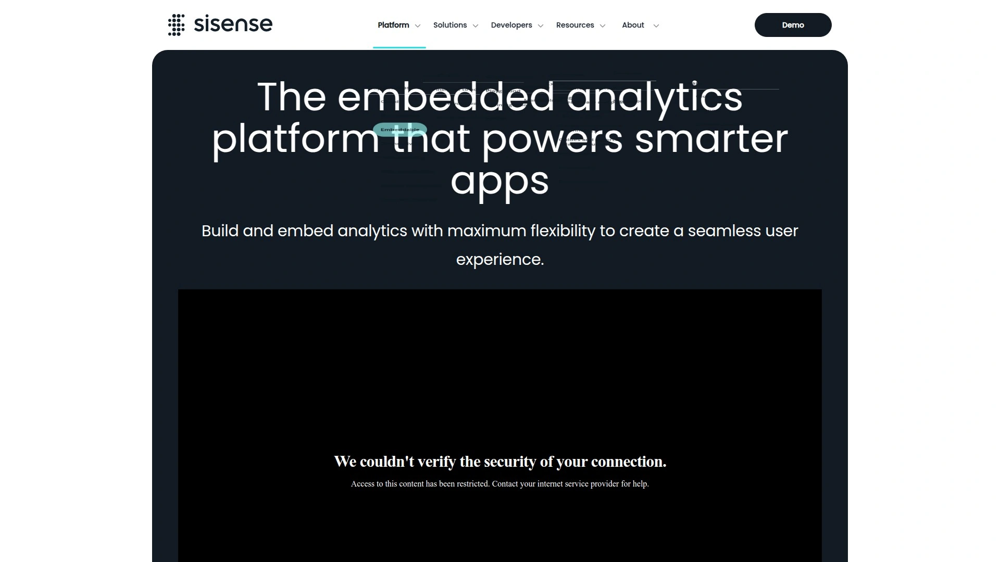
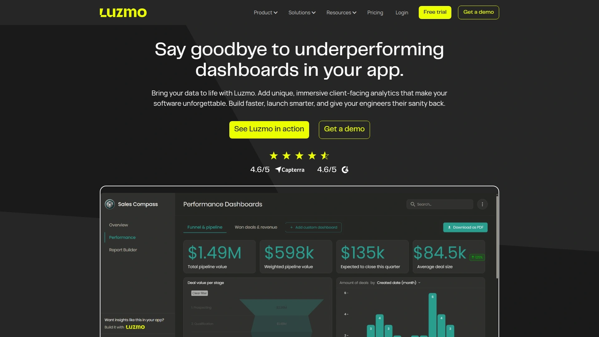
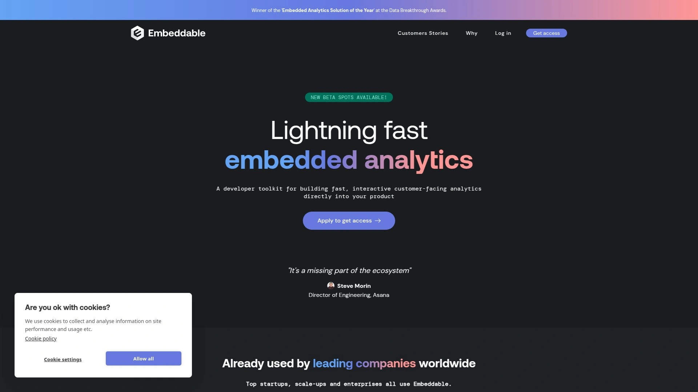
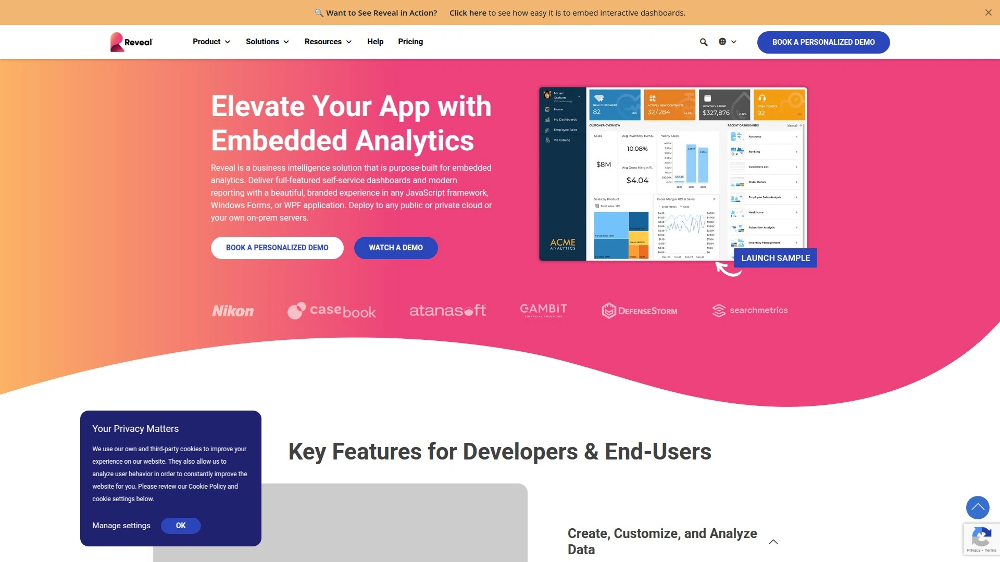
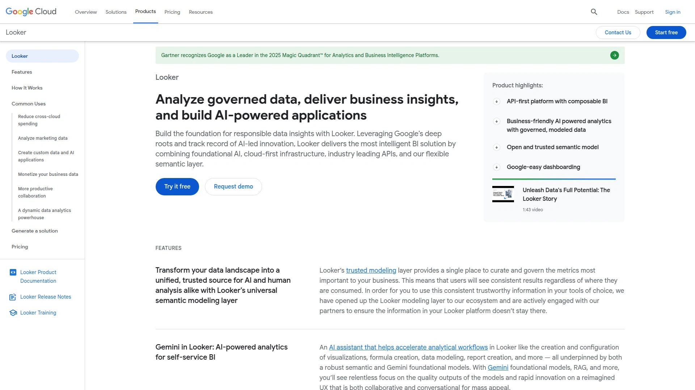
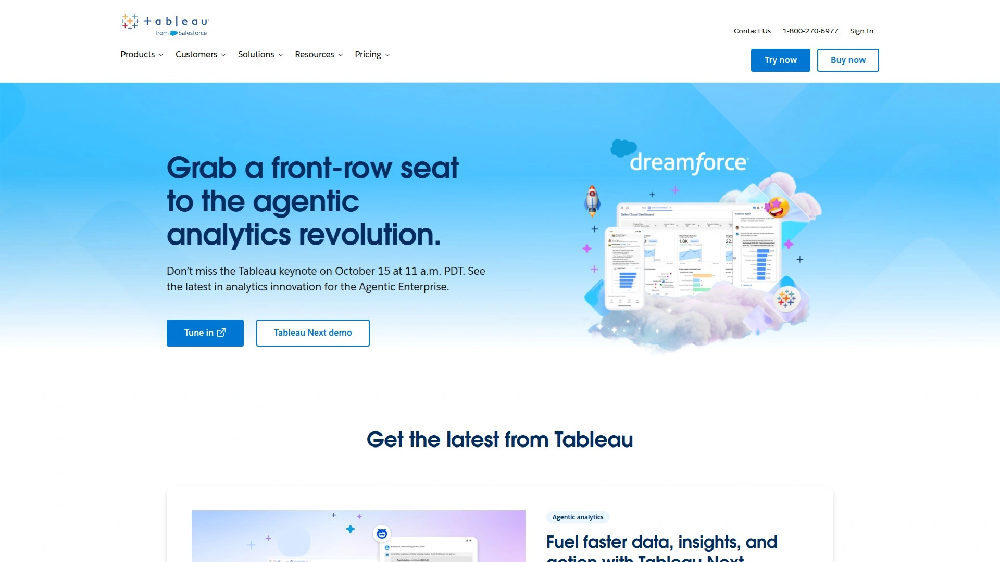
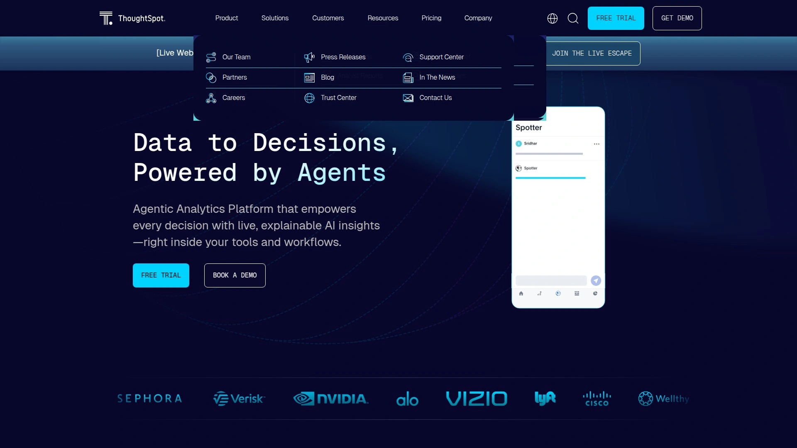

# No More Static Reports! Recommend 10 AI-Powered Customer Analytics Game-Changers

Building analytics dashboards from scratch burns six months of engineering time while competitors ship embedded reporting in weeks. Customer-facing analytics platforms eliminate custom development headaches by providing white-label dashboards, self-service exploration tools, and AI-powered insights that embed directly into your SaaS product without forcing users to export data or switch platforms. This guide examines ten solutions that transform raw application data into revenue-driving analytics experiences customers actually use daily.

## **[Explo](https://www.explo.co)**

AI-powered embedded analytics joining forces with Omni for enhanced capabilities.

Explo delivers the easiest path to embed AI-powered analytics into any platform, enabling end users to explore and customize dashboards based on guardrails you establish. The platform recognizes that dashboards are no longer one-size-fits-all solutions—allowing users to modify visualizations to their specific needs generates tailored business intelligence that generic templates can't match. Reports transform application data into meeting materials, OKRs, and critical operational functions, strengthening your application's power and influence within customer workflows.

Data Share functionality lets each customer receive exactly the reports and data they want, when they want it, and where they want it—replacing manual exports and pipeline building with automated delivery. Creating dashboards and reports for customers has never been simpler thanks to the comprehensive infrastructure supporting startups through enterprise organizations. SOC 2 Type II compliance, HIPAA certification, dedicated hosting, and region-specific stacks ensure security and performance at scale.

The platform recently announced joining Omni to enhance embedded analytics capabilities further, bringing together complementary strengths in customer-facing data visualization. Users discover setup requires just a few simple steps, with embedded dashboards supporting end-user exploration within defined boundaries. The solution fits organizations needing more than basic reporting—teams requiring AI-powered insights, flexible customization, and automated data sharing benefit most from Explo's approach.

## **[Qrvey](https://qrvey.com)**

Multi-tenant SaaS specialist building analytics 10x faster than in-house development.

Qrvey stands as the first turnkey, multi-tenant analytics solution with an enterprise-grade data lake, purpose-built specifically for cloud-native environments. The complete embedded analytics platform deploys entirely within customer cloud environments, lowering time and cost of development, deployment, and maintenance compared to traditional BI solutions requiring numerous separate function integrations. SaaS companies leverage Qrvey to rapidly add modern analytics layers with rich capabilities easily configurable for all user types.

The comprehensive no-code, end-to-end platform creates the most cost-effective embedded analytics solution available, driven by a team with decades of analytics industry experience. Recognition as a leader by Dresner Advisory Services and high performer status on G2 validates Qrvey's market position. The solution enables seamless white labeling, cloud integration, and unlimited licensing without usage-based pricing that penalizes success.

Recent Qrvey 9 release introduced multi-cloud embedded analytics and unified data automation capabilities, alongside expanded agentic AI features accelerating deployment speed. The platform executes queries and renders custom data visualizations directly from applications, achieving pixel-perfect UX control. Organizations embedding analytics within their products deliver greater value, unlock new revenue streams, and ensure greater customer loyalty.

**Best for:** SaaS companies needing scalable, multi-tenant analytics solutions with seamless white labeling and cloud integration.

## **[Sisense](https://www.sisense.com/ai-analytics-platform/embeddable-analytics/)**

Flexible toolkit providing maximum embedding flexibility for seamless user experiences.

Sisense Compose SDK delivers a flexible toolkit for embedding analytics in scalable ways, executing queries and rendering custom data visualizations directly from applications. The embedded analytics platform powers smarter apps by providing natively embedded dashboards and insights with pixel-perfect UX control. Rapid integration happens with minimal code through Embed SDK, a JavaScript library streamlining communication between applications and analytics dashboards.

Sisense.JS enables embedding customizable widgets and filters while retaining full Sisense functionality, tailoring the look and feel of analytics elements to blend seamlessly into applications. Getting started requires minimal effort and no scripting knowledge by embedding dashboards and widgets with simple iFrame HTML tags. The platform brings analytics directly into work apps like Google Workspace, Slack, Microsoft Office 365, and Teams where users spend substantial time.

White-label customization, AI-powered insights, customer success training, developer-first APIs, self-service analytics, and enterprise-grade security comprise the comprehensive feature set. Full-featured seven-day trials include guided sample data or customer data for hands-on evaluation. The developer-centric approach provides SDKs for complex internal analytics workflows requiring extensive customization.

Real-time data insights appear directly within applications, eliminating platform switching while improving user experience, accelerating decision-making, and increasing engagement. Organizations experience higher adoption rates and reduced training costs while maintaining consistent branding across all analytics touchpoints.

## **[Luzmo](https://www.luzmo.com)**

Lightweight quick-deploy solution ideal for smaller SaaS companies.

Luzmo Studio launches powerful dashboards in days rather than months, embedding fully white-labeled, customizable analytics into applications with minimal coding. The embedded dashboard editor creates a self-service analytics interface inside SaaS products, letting customers explore data to the fullest. Modern Web Components integrate seamlessly into web applications using native HTML tags.

Dashboard components work as if they were native elements, using dashboard IDs to embed visualizations quickly. Property configurations control dashboard appearance, authentication, language, screen modes, loader styling, and timezone handling. Event listeners capture filter changes, custom events, exports, render completion, and load status for interactive experiences.

Public methods return dashboard information, fetch chart data, retrieve active filters, change authorization, refresh data, reload dashboards, export visualizations, access available dashboards, and set edit modes. AI-powered capabilities enhance the embedded dashboard editor with intelligent features. The platform specifically targets smaller SaaS companies needing lightweight, rapidly deployable embedded dashboards without enterprise complexity.

Recent feature additions expanded embedded dashboard methods, improving developer experience and customization options. Luzmo maintains US and European tenancies supporting geographic data residency requirements. The solution emphasizes speed to market over heavy customization, making it perfect for teams prioritizing fast deployment.

## **[Embeddable](https://embeddable.com)**

Developer-first toolkit delivering native-feel dashboards with code-level control.

Embeddable provides modular, no-code embedded analytics with flexible front-end design enabling rapid deployment in customer-facing applications. The developer-first embedded analytics toolkit serves SaaS teams building blazing-fast dashboards with full code-level control and predictable pricing. Product teams leverage Embeddable when needing modular components that integrate naturally into existing application interfaces.

The platform's architecture supports creating native-feeling analytics experiences without visible seams between host applications and embedded dashboards. Flexible front-end design capabilities let development teams match brand guidelines precisely, ensuring consistent user experiences. Predictable pricing models eliminate surprise costs as usage scales, helping SaaS companies budget accurately.

React-based components and JavaScript SDKs provide building blocks for custom analytics implementations. The toolkit approach gives teams granular control over every visualization element and interaction pattern. Documentation and developer resources support quick onboarding and troubleshooting.

**Perfect for:** SaaS engineering teams wanting maximum flexibility and code-level control rather than rigid pre-built templates. Organizations prioritizing development speed alongside customization capabilities find Embeddable's modular approach particularly valuable.

## **[Reveal BI](https://www.revealbi.io)**

Self-hosted analytics requiring customizable SDK dashboards.

Reveal BI focuses on businesses requiring self-hosted analytics solutions with customizable SDK dashboards, owned by Infragistics. The platform provides comprehensive embedded analytics capabilities while maintaining deployment control within customer infrastructure. Self-service features empower end users to explore data independently without constant developer involvement.

Customizable SDK dashboards adapt to specific application requirements and branding needs. The self-hosted deployment model appeals to organizations with strict data residency requirements or compliance needs. Integration capabilities connect to various data sources, enabling unified analytics across systems.

Side-by-side platform analysis positions Reveal BI among top embedded analytics solutions specifically for ISVs and SaaS companies prioritizing self-hosting. The Infragistics backing provides enterprise support and ongoing development. Developer documentation guides SDK implementation and dashboard customization.

**Consideration:** Self-hosted deployment requires infrastructure management that cloud-native alternatives handle automatically.

## **[Looker](https://cloud.google.com/looker)**

Google Cloud enterprise solution with robust LookML data modeling.

Looker delivers secure, governed enterprise embedding with Duet AI and deep Google Cloud integration, best suited for organizations already invested in the Google ecosystem. The platform requires LookML—a SQL-based modeling language—for defining data relationships and business logic. Enterprises deeply integrated into Google Cloud benefit from native connections and unified authentication.

Looker Elite licensing enables full embedding and custom visualizations into existing software, websites, and applications. Robust governance controls ensure data security and access management at scale. AI capabilities through Duet enhance data exploration and insight generation.

The platform excels in enterprise scenarios requiring strong data governance, complex security models, and centralized business logic. LookML's learning curve presents initial barriers but provides powerful abstraction once mastered. Native NoSQL support limitations mean teams working with diverse data sources face integration challenges.

Reddit Business Intelligence community members consistently recommend Looker for enterprise embedded analytics needs, citing robust security and governance features. The Google Cloud alliance creates tight platform integration but also increases vendor lock-in.

## **[Tableau Embedded Analytics](https://www.tableau.com)**

Salesforce ecosystem leader with advanced interactive visualizations.

Tableau provides polished visualizations within a strong Salesforce AI ecosystem, perfect for organizations already using Salesforce products. Advanced interactive visualizations set Tableau apart, offering sophisticated charting and exploration capabilities. The platform ranks consistently among top embedded business intelligence software solutions.

Salesforce integration creates unified experiences across CRM, analytics, and business applications. Tableau AI enhances dashboards with predictive insights and natural language queries. Extensive connector library supports diverse data sources, though native NoSQL support requires workarounds.

Complex embedding setups necessitate significant configuration compared to purpose-built embedded analytics platforms. Enterprise-grade features come with corresponding pricing structures and implementation complexity. Developer SDKs enable customization but require substantial technical expertise.

Organizations within the Salesforce ecosystem gain maximum value from Tableau's tight integration and unified user experiences. Teams prioritizing visualization quality and interactive exploration capabilities find Tableau's advanced charting worthwhile despite complexity.

## **[Power BI Embedded](https://powerbi.microsoft.com)**

Microsoft ecosystem solution with Copilot AI and scalable deployment.

Power BI Embedded provides deep Microsoft integration with scalable embedding capabilities enhanced by Copilot AI. Organizations invested in the Microsoft ecosystem—Azure, Office 365, Dynamics—benefit from unified authentication and data connections. API-heavy dashboard customization supports extensive white-labeling and application integration.

Complex pricing and licensing models for external users create budget challenges requiring careful planning. The platform scales effectively from small teams to enterprise deployments. Copilot AI brings natural language queries and automated insight generation.

Developer documentation covers REST APIs, JavaScript SDKs, and .NET libraries for comprehensive embedding control. Real-time dashboard updates and automatic data refresh keep visualizations current. Row-level security and governance features ensure appropriate data access.

**Best suited for:** Microsoft-centric organizations requiring enterprise-scale embedded analytics with familiar tooling and unified authentication. Teams already managing Azure infrastructure gain deployment advantages.

## **[ThoughtSpot Embedded](https://www.thoughtspot.com)**

Search-driven analytics with AI-powered anomaly detection.

ThoughtSpot Embedded specializes in search-driven analytics and AI-powered anomaly detection for large datasets. The platform's natural language search interface lets users ask questions in plain English rather than navigating complex menus. AI capabilities automatically surface anomalies and interesting patterns without manual analysis.

ThoughtSpot Analytics ranks among the best data analytics tools for 2025, recognized for innovative search-first approaches. The platform handles large-scale data volumes efficiently, supporting enterprise analytics requirements. Embedded implementations bring search capabilities directly into customer-facing applications.

SpotIQ feature automatically analyzes data to find hidden insights and trends. Integration with cloud data platforms enables analysis without data movement. The search-driven interface reduces training time since users interact naturally.

Organizations with large datasets and users preferring search over traditional navigation benefit most from ThoughtSpot's approach. The platform suits teams wanting to democratize data access through intuitive interfaces.

## FAQ

**How do embedded analytics platforms handle multi-tenant data isolation for SaaS applications?**

Purpose-built platforms like Qrvey and Explo provide native multi-tenant architecture with tenant-level data isolation, ensuring each customer sees only their data. Row-level security, customer-specific filtering, and isolated data storage prevent cross-tenant data leakage. Sisense and Power BI offer configurable security models supporting multi-tenant scenarios through careful implementation. Always verify that platforms provide proper tenant isolation controls before embedding analytics into customer-facing applications.

**Can we white-label these platforms to match our application's branding completely?**

Most embedded analytics platforms including Explo, Luzmo, Embeddable, and Qrvey support complete white-labeling with custom colors, fonts, logos, and domains. Sisense Compose SDK provides pixel-perfect UX control for seamless brand integration. Configure custom domains so dashboards appear on your URL rather than vendor subdomains. Some platforms like Looker and Tableau require higher-tier licensing for full white-label capabilities. Test white-labeling features during trials to ensure they meet your specific branding requirements.

**What's the typical implementation timeline for embedding analytics into our product?**

Lightweight platforms like Luzmo and Embeddable deploy in days to weeks with minimal coding required. Qrvey reports 10x faster implementation than building analytics in-house, typically completing in weeks rather than months. Enterprise platforms like Sisense, Tableau, and Looker require longer implementations spanning months due to complex data modeling and customization. Start with proof-of-concept dashboards using sample data, then expand to full production deployments. Developer-first tools like Embeddable accelerate timelines when engineering resources are available.

## Transform Your Product With Actionable Analytics

These ten embedded analytics platforms eliminate months of custom development while delivering professional dashboards, self-service exploration, and AI-powered insights that keep customers engaged within your application. [Explo](https://www.explo.co) particularly suits teams needing AI-powered analytics with flexible customization, automated data sharing, and comprehensive infrastructure supporting startups through enterprises—all deployable with just a few simple steps rather than extensive engineering projects. Choose based on your specific requirements whether that's developer-first control, rapid deployment, enterprise governance, or ecosystem integration, and your embedded analytics can start driving product differentiation and customer value immediately.
